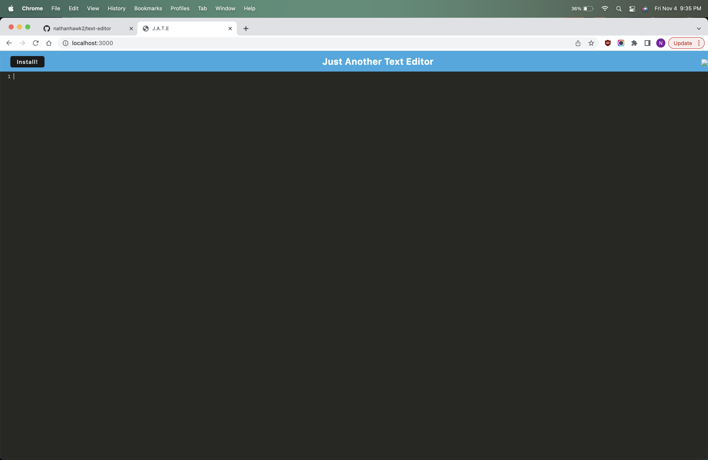
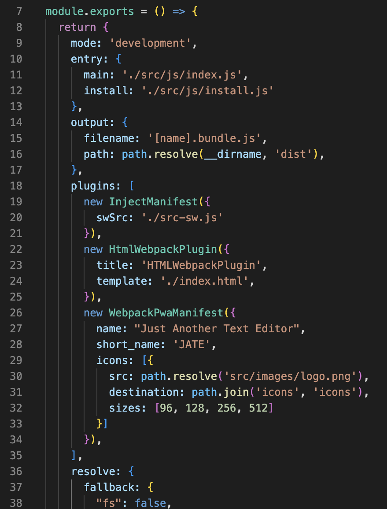

# Text Editor

## Description

When you open the app locally, you are able to log in and type on the page as if you were typing in the console. You can also download it and use it offline.

## Visuals

## Installation
Run npm i to install all the dependencies, then npm run build it, then npm run start:dev to finally start the website.